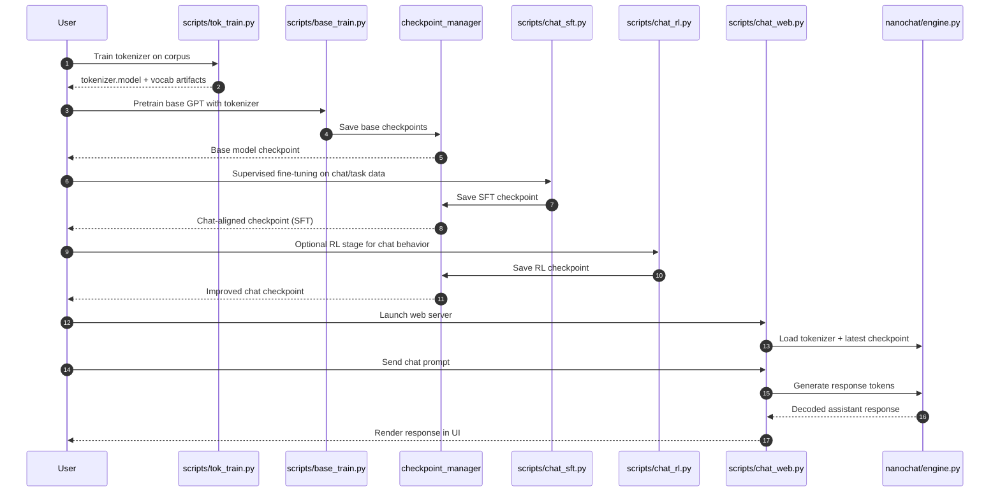

# nanochat Architecture & Flow Diagrams

This document provides high-level system diagrams for how nanochat is organized and how data/model artifacts move through the pipeline.

## 1) High-Level Architecture Diagram

```mermaid
flowchart LR
    subgraph Data[Data & Tasks]
        RAW[Raw text corpora\n(FineWeb / custom data)]
        CHATDATA[Chat/SFT task datasets\n(tasks/*.py)]
    end

    subgraph Tok[Tokenizer Stage]
        TOKTRAIN[scripts/tok_train.py]
        TOKEVAL[scripts/tok_eval.py]
        TOKENIZER[nanochat/tokenizer.py\ntrained BPE tokenizer]
    end

    subgraph Base[Base Model Stage]
        BASETRAIN[scripts/base_train.py]
        DATALOADER[nanochat/dataloader.py\nnanochat/dataset.py]
        GPT[nanochat/gpt.py]
        OPT[nanochat/optim.py]
        CKPT[nanochat/checkpoint_manager.py]
        BASEEVAL[scripts/base_eval.py\nnanochat/core_eval.py\nnanochat/loss_eval.py]
    end

    subgraph Chat[Chat Alignment Stage]
        SFT[scripts/chat_sft.py]
        RL[scripts/chat_rl.py]
        CHATEVAL[scripts/chat_eval.py]
    end

    subgraph Infer[Inference & UI Stage]
        ENGINE[nanochat/engine.py\nKV-cache inference]
        CLI[scripts/chat_cli.py]
        WEB[scripts/chat_web.py]
        UI[nanochat/ui.html]
        EXEC[nanochat/execution.py\noptional code execution tool]
    end

    RAW --> TOKTRAIN --> TOKENIZER
    TOKENIZER --> TOKEVAL

    RAW --> DATALOADER --> BASETRAIN
    TOKENIZER --> BASETRAIN
    GPT --> BASETRAIN
    OPT --> BASETRAIN
    BASETRAIN --> CKPT
    CKPT --> BASEEVAL

    CHATDATA --> SFT --> CKPT
    CKPT --> RL --> CKPT
    CKPT --> CHATEVAL

    CKPT --> ENGINE
    TOKENIZER --> ENGINE
    ENGINE --> CLI
    ENGINE --> WEB --> UI
    ENGINE --> EXEC
```

## 2) Sequence Diagram (End-to-End Training to Chat)



## 3) Activity Diagram (Interactive Inference Request Lifecycle)

```mermaid
flowchart TD
    START([User sends prompt]) --> LOAD{Model + tokenizer\nloaded?}
    LOAD -- No --> INIT[Load checkpoint + tokenizer into engine]
    INIT --> ENCODE
    LOAD -- Yes --> ENCODE[Encode prompt to tokens]

    ENCODE --> PREP[Prepare KV cache / sampling params]
    PREP --> GEN{Generation loop}

    GEN --> FORWARD[Run GPT forward pass]
    FORWARD --> SAMPLE[Sample next token\n(temperature/top-k)]
    SAMPLE --> STOP{Stop condition?\n(eos/max tokens/user stop)}

    STOP -- No --> APPEND[Append token to context/cache]
    APPEND --> GEN
    STOP -- Yes --> DECODE[Decode tokens to text]

    DECODE --> TOOL{Tool execution enabled\nand requested?}
    TOOL -- Yes --> EXEC[nanochat/execution.py\nrun tool + collect output]
    EXEC --> POST[Post-process final response]
    TOOL -- No --> POST

    POST --> RETURN([Return response to CLI/Web UI])
```

